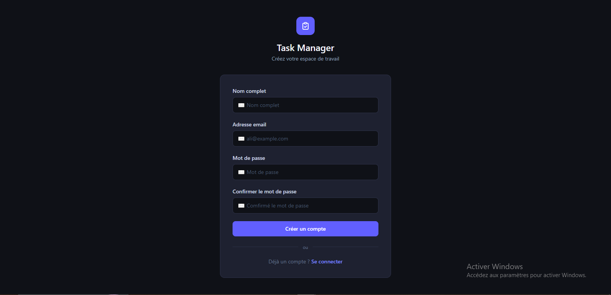
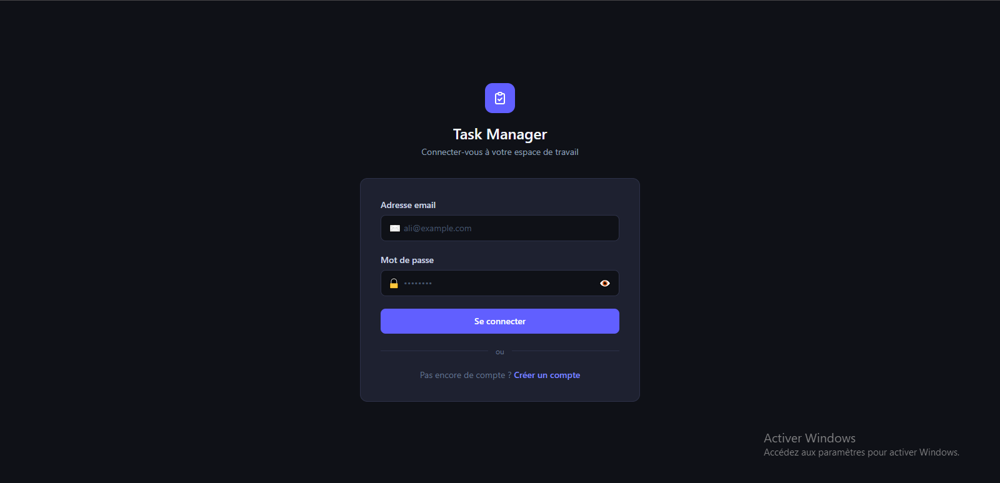
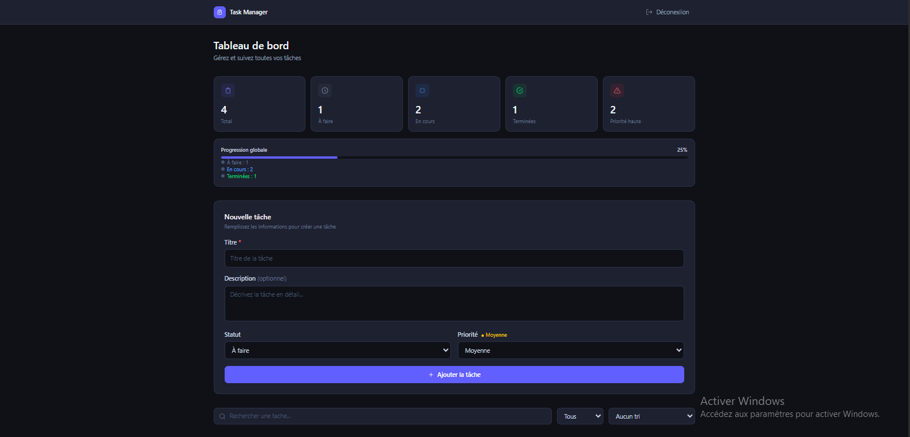

<div align="center">

# 📋 Task Manager Full Stack

**Application web de gestion de tâches avec authentification sécurisée**


[🚀 Voir la démo](#) · [🐛 Signaler un bug](https://github.com/ali-elghallab/Task-Manager-Full-Stack/issues)

</div>

---

## 📸 Screenshots

| Register| Login | Dashboard |
|---------|-------|-----------|
|  |  |  |

---

## ✨ Fonctionnalités

- 🔐 **Authentification sécurisée** — Inscription / Connexion avec JWT et bcrypt
- ✅ **CRUD complet** — Créer, consulter, modifier et supprimer des tâches
- 🔍 **Recherche en temps réel** — Filtrage par titre instantané
- 🎯 **Filtres avancés** — Par statut (À faire / En cours / Terminée)
- 📊 **Tri intelligent** — Par titre (A→Z) ou par priorité
- 📈 **Tableau de bord statistique** — Vue d'ensemble avec barre de progression
- 🛡️ **Routes protégées** — Accès restreint aux utilisateurs authentifiés
- 🌙 **Dark mode** — Interface entièrement en mode sombre

---

## 🛠️ Stack technique

| Couche | Technologie |
|--------|-------------|
| **Frontend** | React.js, React Router, Axios, Tailwind CSS |
| **Backend** | Node.js, Express.js |
| **Base de données** | Microsoft SQL Server (SSMS) |
| **Authentification** | JSON Web Token (JWT), bcrypt |
| **Outils** | Git, GitHub, Postman, VS Code |

---

## 🏗️ Architecture

```
task-manager/
├── client/                  # Frontend React
│   └── src/
│       ├── components/      # Composants réutilisables
│       ├── pages/           # Pages principales
│       ├── context/         # AuthContext (état global)
│       └── services/        # Appels API (Axios)
│
└── server/                  # Backend Node.js
    ├── config/              # Connexion base de données
    ├── controllers/         # Logique métier
    ├── middlewares/         # Auth JWT, validation
    └── routes/              # Endpoints API REST
```

---

## 🚀 Installation

### Prérequis

- [Node.js](https://nodejs.org/) v18+
- [Microsoft SQL Server](https://www.microsoft.com/fr-fr/sql-server) + SSMS
- [Git](https://git-scm.com/)

### 1. Cloner le projet

```bash
git clone https://github.com/ali-elghallab/Task-Manager-Full-Stack.git
cd Task-Manager-Full-Stack
```

### 2. Configurer la base de données

Ouvrir SSMS et exécuter le script suivant :

```sql
CREATE DATABASE [TaskManager];
USE [TaskManager];

CREATE TABLE Users (
    id          INT IDENTITY(1,1) PRIMARY KEY,
    username    NVARCHAR(50)  NOT NULL UNIQUE,
    email       NVARCHAR(100) NOT NULL UNIQUE,
    password    NVARCHAR(255) NOT NULL,
    created_at  DATETIME DEFAULT GETDATE()
);

CREATE TABLE Tasks (
    id          INT IDENTITY(1,1) PRIMARY KEY,
    user_id     INT           NOT NULL,
    title       NVARCHAR(200) NOT NULL,
    description NVARCHAR(MAX) NULL,
    status      NVARCHAR(20)  DEFAULT 'À faire',
    priority    NVARCHAR(10)  DEFAULT 'Moyenne',
    created_at  DATETIME DEFAULT GETDATE(),
    CONSTRAINT FK_Tasks_Users FOREIGN KEY (user_id)
        REFERENCES Users(id) ON DELETE CASCADE
);
```

### 3. Configurer le Backend

```bash
cd server
npm install
```

Créer un fichier `.env` en copiant `.env.example` :

```bash
cp .env.example .env
```

Remplir les variables dans `.env` :

```env
DB_USER=sa
DB_PASSWORD=ton_mot_de_passe
DB_SERVER=localhost
DB_PORT=1433
DB_NAME=TaskManager
JWT_SECRET=une_cle_secrete_longue_et_aleatoire
PORT=5000
```

Démarrer le serveur :

```bash
npm start
```

✅ Le serveur tourne sur `http://localhost:5000`

### 4. Configurer le Frontend

```bash
cd ../client
npm install
npm start
```

✅ L'application tourne sur `http://localhost:3000`

---

## 🔌 API Endpoints

### Authentification

| Méthode | Endpoint | Description | Auth |
|---------|----------|-------------|------|
| `POST` | `/api/auth/register` | Créer un compte | ❌ |
| `POST` | `/api/auth/login` | Se connecter | ❌ |
| `GET` | `/api/auth/me` | Profil utilisateur | ✅ |

### Tâches

| Méthode | Endpoint | Description | Auth |
|---------|----------|-------------|------|
| `GET` | `/api/tasks` | Toutes les tâches | ✅ |
| `POST` | `/api/tasks` | Créer une tâche | ✅ |
| `PUT` | `/api/tasks/:id` | Modifier une tâche | ✅ |
| `DELETE` | `/api/tasks/:id` | Supprimer une tâche | ✅ |

---

## ⚙️ Variables d'environnement

| Variable | Description | Exemple |
|----------|-------------|---------|
| `DB_USER` | Utilisateur SQL Server | `sa` |
| `DB_PASSWORD` | Mot de passe SQL Server | `MonMotDePasse` |
| `DB_SERVER` | Adresse du serveur | `localhost` |
| `DB_PORT` | Port SQL Server | `1433` |
| `DB_NAME` | Nom de la base | `TaskManager` |
| `JWT_SECRET` | Clé secrète JWT | `cle_aleatoire_longue` |
| `PORT` | Port du backend | `5000` |

---

## 👨‍💻 Auteur

**Ali El Ghallab**

[](https://github.com/ali-elghallab)
[](https://www.linkedin.com/in/ali-el-ghallab/)

---

<div align="center">
  <sub>Projet réalisé dans le cadre d'un portfolio étudiant</sub>
</div>
